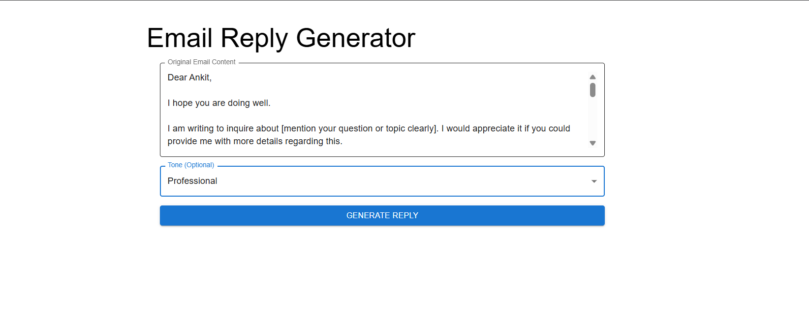
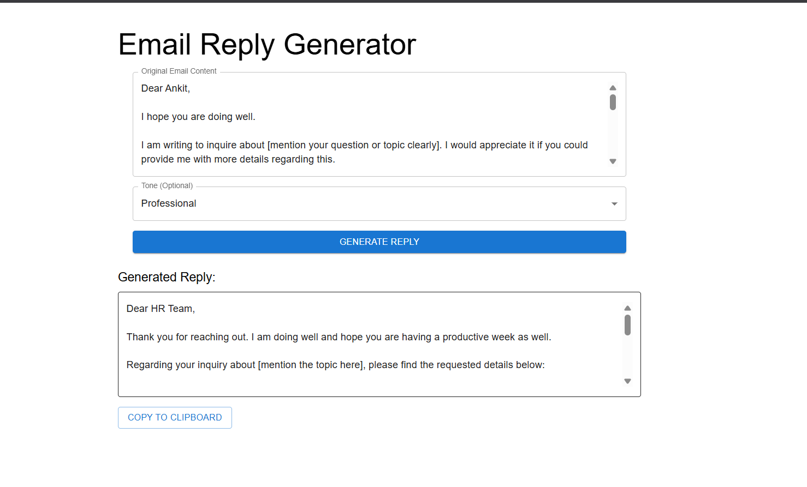
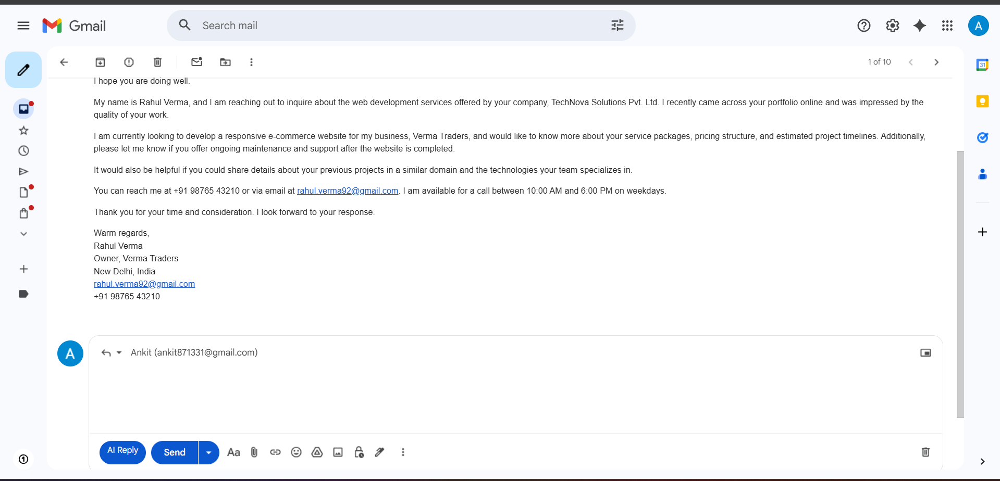
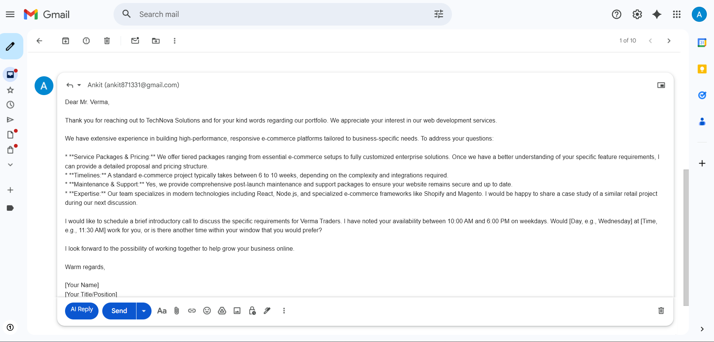
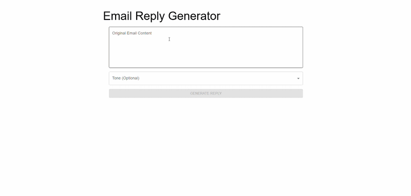
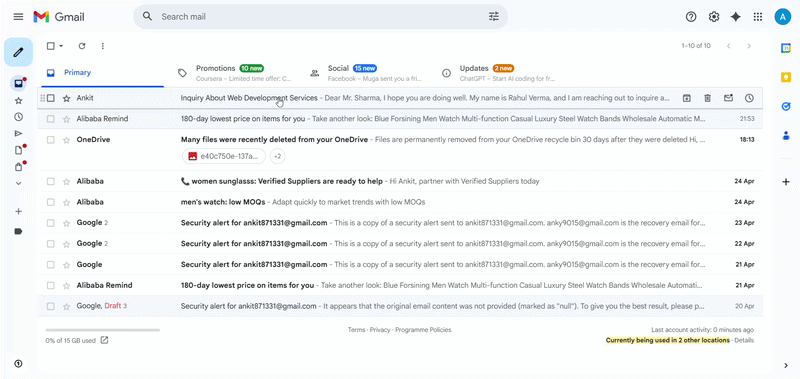

# 📧 Email AI Suite – AI Email Generator

🔗 **Live Demo:** (Add your link here)

---

## 🚀 Overview

**Email AI Suite** is a real-world productivity tool that transforms simple prompts into **professional, well-structured emails using AI**.

Writing emails can be time-consuming—especially when you need the right tone, clarity, and professionalism. This project simplifies that process by generating ready-to-send emails instantly.

⚠️ Not a replacement for human communication—but a powerful assistant to enhance it.

---

## ⚙️ How It Works

### 🌐 Web Version

1. Copy the email you want to reply to  
2. Paste it into the web app and select tone  

3. Get your AI-generated reply instantly  

---

### 🔌 Chrome Extension

1. Add the extension to your browser  
2. Click the **Reply** button → Select **AI Generate**

---

## 🎥 Demo

---

## 🎯 Problem

- Writing professional emails takes time  
- Tone selection (formal/casual) is confusing  
- Repetitive drafting reduces productivity  
- Lack of confidence in structured writing  

---

## 💡 Solution

**Email AI Suite solves this by:**

- ✍️ Generating emails from simple prompts  
- 🧠 Understanding tone and context using AI  
- ⚡ Delivering instant structured responses  
- 🌐 Available as Web App + Chrome Extension  

---

## 🛠️ Tech Stack

### Frontend
- React.js  
- JavaScript  
- HTML / CSS  

### Backend
- Java 17  
- Spring Boot  
- REST APIs  

### AI
- Google Gemini API  

### Tools
- Maven  
- Node.js  
- Chrome Extension APIs  

---

## ✨ Features

- ⚡ Instant email generation  
- 🧠 Smart tone detection  
- 🌐 Clean UI  
- 🔌 Chrome extension  
- 💼 Professional use-ready  
- 🚀 Scalable full-stack system  

---

## 🧠 Challenges Faced

### 1. AI Response Quality  
👉 Improved prompt engineering  

### 2. Tone Control  
👉 Added structured input + context  

### 3. API Handling  
👉 Optimized latency & error handling  

### 4. Full Stack Sync  
👉 Clean REST API flow  

---

## 🔮 Future Improvements

- 🌍 Multi-language support  
- 📚 Email templates  
- 🔐 Authentication system  
- ☁️ Cloud deployment  
- 📊 Dashboard & history  
- 🤖 Smarter personalization  

---

## ⚠️ Disclaimer

- AI responses may not always be perfect  
- Always review before sending  
- Built as a productivity assistant  

---

## 👨‍💻 Author

**Ankit**  
💻 Full Stack Developer | Java • React • AI  

---

## ⭐ Support

If you like this project, give it a ⭐ on GitHub!